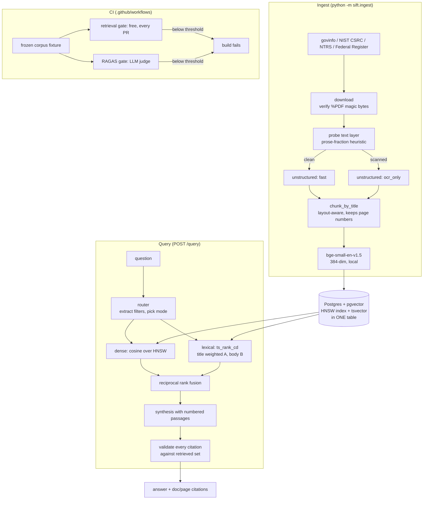

# Sift — Document Intelligence Pipeline

A retrieval system over messy public-sector PDFs — GAO reports, NIST
publications, NASA technical reports, the Federal Register — that answers
questions with page-level citations, and **fails its own CI build when answer
quality regresses.**

The last part is the point. Building a RAG demo is easy. Knowing that today's
version is not quietly worse than last week's is the hard part, and it is the
part that decides whether a system is deployable.

```bash
git clone <this-repo> && cd sift
docker compose up -d db                       # Postgres + pgvector
pip install -r requirements.txt
python -m sift.ingest --limit 500             # download, parse, chunk, embed
uvicorn sift.api:app --reload                 # http://localhost:8000/docs
```

---

## The problem

Government documents are hostile to naive RAG in specific, measurable ways:

- They are **multi-column**, so text extracted in the wrong order reads as word
  salad while raising no error.
- They are **table-heavy**, and a character-based splitter cuts tables in half.
- Many are **scans** — and the worst ones carry a text layer from decades-old
  OCR, so they *look* machine-readable and silently are not.
- The answers people need are **specific**: a number, a date, a statutory
  citation. "Roughly right" is wrong.

A pipeline that assumes clean text will produce fluent, confident, unsourced
answers over garbage. In a government setting that is worse than no system,
because the output is indistinguishable from a correct one.

---

## Results

Measured on the **full local corpus** — 460 parsed documents, 54,981 chunks,
29 of them scanned — against 36 hand-checked questions. This is the number that
describes the system. The CI gate runs on a smaller committed sample and scores
slightly better; both are shown below, because reporting only the easier one is
the exact drift this project exists to catch.

<!-- RESULTS:START -->
| Metric | Score |
|---|---|
| Recall@6 | **0.9375** |
| MRR | **0.8812** |
| Documents parsed | **460/500** |
| Chunks indexed | 54981 |
| Median retrieval latency | **214 ms** |
| p95 retrieval latency | 356 ms |
| Identical results under a different query plan | **yes** |
<!-- RESULTS:END -->

Retrieval metrics are deterministic and need no API key — they run on every pull
request. See [Evaluation](#evaluation).

That now includes two of RAGAS's four metrics. RAGAS's `context_precision` and
`context_recall` are LLM-judged by default, but it also ships
`IDBasedContextPrecision` and `IDBasedContextRecall`, which compare retrieved
document ids against reference ids — set arithmetic, no model, no key. The eval
set already carries `gold_doc_ids`, so these cost nothing and gate on every pull
request rather than only where a secret exists:

| Metric | full corpus | CI fixture | floor |
|---|---|---|---|
| `id_based_context_precision` | 0.5776 | 0.6417 | 0.50 |
| `id_based_context_recall` | 0.9062 | 0.9141 | 0.85 |
| `passage_precision` | 0.6615 | 0.7292 | 0.55 |

Only **faithfulness** and **answer_relevancy** genuinely need a judge — one is
entailment checking over each claim, the other generates questions from the
answer. Those two remain unmeasured, and are reported as unmeasured.

**Full corpus vs. the CI sample.** Same questions, same code, different amounts
of competition:

| | full corpus (460 docs) | CI fixture (281 docs) |
|---|---|---|
| Recall@6 | 0.9375 | 0.9375 |
| MRR | **0.8812** | 0.8958 |
| p50 latency | 214 ms | 113 ms |

Recall is identical because the same two questions fail either way. MRR is
**0.015 higher on the sample** — with 179 fewer documents competing, gold
passages rank higher. That gap is the cost of a fast gate, and it is the reason
the headline above quotes the full-corpus number.

Both MRR figures differ from the ones this README carried previously (0.8578 and
0.9125). Nothing about retrieval quality improved: the earlier numbers were
single draws from a distribution, because tied rows were being dropped by a
`LIMIT` in whatever order the query planner happened to produce them. The gate
now re-runs every question under different planner settings and fails if any
answer changes — see [failure mode 13](docs/FAILURE_MODES.md).

**Where it still fails.** Two questions miss, both documented rather than
tuned away:

- **q017** asks what a rule changed about references to the "General Accounting
  Office". The phrase is overwhelmingly associated with GAO documents, so
  retrieval returns GAO reports; the answer is in a Federal Register rule that
  renames the agency. A genuine limitation of lexical + dense retrieval without
  query rewriting — though this README asserted that for a while on the strength
  of a mislabelled gold document, and only checking it made the claim true. See
  [failure mode 17](docs/FAILURE_MODES.md).
- **q025** is an OCR question whose answer sits in a 1967 microfiche scan that
  competes with a closely related NASA document from the same series.

The `ocr` category scores **0.75**, the lowest of the six. That is the honest
cost of retrieving over machine-read scans, and it is why the category is broken
out rather than averaged away.

---

## Architecture



**Why one Postgres table holds both the vector and the full-text index.** There
is no second service to keep in sync, a chunk's embedding and its lexical index
cannot drift apart, and metadata filters compose with both retrievers — "NIST
documents from 2024" is a `WHERE` clause, not a separate filtered-search API.

---

## What broke and how I handled it

The full account is in **[docs/FAILURE_MODES.md](docs/FAILURE_MODES.md)**. The
seven worth reading:

### `hi_res` produced the cleanest-looking and least readable text

Unstructured's `hi_res` strategy runs layout detection before OCR. On a 1967
NASA microfiche scan it carves the page into regions and emits them in the wrong
reading order — correct words, scrambled sentences. Every layout-based quality
metric rates it *excellent*, because the lines are well formed.

I measured it instead of guessing (`scripts/compare_strategies.py`), scoring
readability by common-English-bigram density, which survives
correct-words-wrong-order:

| strategy | seconds | garbled score | bigrams/1k |
|---|---|---|---|
| fast | 11.7 | 0.81 | 48.5 |
| hi_res | 40.1 | 0.05 | **23.9** ← worst |
| ocr_only | 36.3 | 0.04 | **50.4** ← best |

Scanned documents now route to `ocr_only`: faster *and* markedly more faithful.
The tradeoff — no table-structure reconstruction — is right for this corpus of
technical prose and would be wrong for scanned financial tables.

### Lexical search returned zero rows and nothing looked broken

`websearch_to_tsquery` joins terms with **AND**, so a natural-language question
demanded that one 1800-character chunk contain every word including "what",
"did" and "find". It matched nothing. Hybrid retrieval still returned
results — it had silently degraded to vector-only.

Fixed by stripping question scaffolding and OR-ing the content terms, letting
`ts_rank_cd` supply precision. Found by evaluation, not by any test or
exception, which is the argument for the CI gate in one sentence.

### Rank fusion depended on database row order

MRR moved between 0.953 and 0.932 on an identical corpus, purely from reloading
the database. RRF score ties are common, Python's sort is stable, and
`TRUNCATE`+reload renumbered the rows. Tie-breaking on `chunk_id` made it
deterministic — and dropped the honest MRR to 0.9167, lower than the number I
would otherwise have published and the first one that means anything.

### The quality gate would have skipped green instead of failing red

`ragas==0.4.3` imports a `langchain-community` module that the 0.4 line deleted,
so `import ragas` raised `ModuleNotFoundError`. Only the provider packages were
pinned, so pip resolved `langchain-community` to 0.4.2 and the eval could not
start.

The bug is not that it broke — it is *how* it would have failed. The RAGAS job
is guarded by "is an API key present?", so a gate that cannot import reports
**skipped**, and skipped renders green. A quality gate that silently does not
run is worse than no gate, because it manufactures confidence. Pinning the whole
langchain family to the 0.3 line fixed it, and CI now runs an explicit
`python -c "import ragas"` so this can only ever fail loudly.

### My first guard against a nondeterministic gate did not work

Two evaluation runs against an untouched database returned MRR 0.9115 and 0.9125.
Both retrievers ended in `ORDER BY <score> LIMIT k` with no tiebreak, and
`ts_rank_cd` ties constantly, so *which* of hundreds of tied rows survived the
`LIMIT` was the query planner's choice. Every published MRR had been one draw
from a distribution.

The fix is a total order on both retrievers. The lexical side takes
`ORDER BY score DESC, c.id` for free. The dense side cannot — `EXPLAIN` shows
that adding `c.id` to the ordering makes the planner abandon the HNSW index for a
full sequential scan — so that query became two-stage: an inner index-ordered
`LIMIT`, an outer deterministic sort.

The part worth keeping is what happened next. I added a check that ran the
evaluation twice and compared. **It passed with the bug still in place.**
Consecutive runs pick the same plan, so they agree with each other while both
remain arbitrary. Two runs agreeing is not evidence of determinism; it is
evidence that nothing perturbed them. The check that works runs the second pass
under deliberately different planner settings and asks whether the answer depends
on how Postgres chose to execute it. Reintroduce the missing tiebreak and it now
fails ten questions.

### The gate failed one build in four, and it was the gate's own fault

Found by running the whole CI sequence — create database, apply schema, load
fixture, evaluate — six times instead of once. One in four failed on latency at
p50 330ms against a 250ms budget, while the rest sat near 100ms.

Not a cold cache, which was the first guess: a cold cache makes the *first*
queries slow, and here every query was slow. It was autovacuum waking up on a
freshly bulk-loaded table and competing with the queries being timed. The loader
now does that housekeeping itself. Six consecutive clean builds then landed at
p50 97–101ms.

A gate that fails a quarter of the time for reasons unrelated to the pull request
does not enforce quality — it teaches people to re-run CI until it goes green,
which is the exact habit that lets a real regression through. A single green run
is not evidence that a gate is stable; it is one sample.

### Two thirds of one source carried other documents' text

No symptom. Nothing failed, the metrics were fine, and CI had been green over it
for the life of the repository. It surfaced because a worksheet built for
hand-checking the eval set sorted questions by how well each gold document
supported its own answer, and q017 came last — the passage answering it carried
the footer `[FR Doc. 2026-16630]` while being stored under `fr-2026-16687`.

The Federal Register API gives a `pdf_url` per document, but the PDF behind it is
a **page extract** from that day's issue. A rule starting halfway down a page
inherits the top of it. **54 of 80** Federal Register documents held text
belonging to another document; `fr-2026-16687` was 37 chunks of which six were
its neighbours', including the opening of an unrelated FAA airworthiness
directive.

That is a citation-correctness bug, which is the one failure this project exists
to prevent: quote a passage, attribute it to a document and page, be pointing at
a different document. Every document ends with a machine-readable filing footer,
so the span is trimmed at those boundaries before chunking. 54 affected documents
became 6 — the remainder are those whose own footer never appears in the text,
where trimming would be guessing, and they are left whole and labelled.

The part worth keeping: this README explained q017's miss as a limit of dense
retrieval without query rewriting. With the gold document corrected, q017 *still*
misses — the explanation was right, and the evidence offered for it was a
mislabelled chunk. Being accidentally right is indistinguishable from being right
until someone checks.

---

## Retrieval

Three things happen before a passage reaches the model.

**1. Routing.** A rules layer reads the query and picks a strategy. It is not an
LLM agent and does not plan — calling it a router is the honest description.

| query | decision |
|---|---|
| "what did NIST publish in 2024 about zero trust" | `filtered` — `source=nist, year=2024` |
| "GAO/NSIAD-95-82" | `keyword` — dense retrieval is bad at identifiers |
| "how do agencies decide whether a control is effective" | `hybrid` — no anchors |

Filters are a `WHERE` clause, so a stated constraint is *guaranteed*, not hoped
for. Every decision is returned in the API response so it can be audited. When a
filter is too strict and returns nothing, the system retries unfiltered and says
that it did.

**2. Hybrid retrieval + reciprocal rank fusion.** Dense (cosine over HNSW) and
lexical (`ts_rank_cd`) run as two SQL queries, fused by rank rather than score:

```
score(d) = Σ 1 / (k + rank_i(d))        k = 60
```

Ranks are used because cosine similarity (~0.4–0.8) and `ts_rank_cd`
(unbounded, corpus-dependent) are not on comparable scales, and any weighted sum
needs constants that go wrong the moment the corpus changes.

**3. Citation validation.** Passages are numbered, the model cites by number,
and every citation is checked against the passages actually retrieved. A
citation outside that range is stripped and recorded — a model that cites `[9]`
of 6 passages does not get to keep it.

---

## Evaluation

Two tiers, split by what they cost to run.

### Tier 1 — deterministic, free, every pull request

```bash
python -m eval.retrieval_eval
```

No LLM, no API key, ~10 seconds. Measures `recall@k`, `MRR`, citation validity,
abstention rate, false-abstention rate, and retrieval latency.

The **false-abstention rate** exists because without it a system that answers
"I don't know" to everything scores a perfect abstention rate.

### Tier 2 — RAGAS, LLM judge

```bash
python -m eval.ragas_eval
```

`faithfulness`, `answer_relevancy`, `context_precision`, `context_recall`.
Costs money and needs `ANTHROPIC_API_KEY` or `OPENAI_API_KEY`.

### Why the split matters

If the only gate needed a paid key, pull requests from forks would silently skip
it — and "CI enforces answer quality" would be false in exactly the case where
you least control the code. Tier 1 always runs.

Which makes it worth asking, per metric, whether it *actually* needs the judge
rather than assuming the tier it shipped in. Two of RAGAS's four did not:
`IDBasedContextPrecision` and `IDBasedContextRecall` score by comparing
retrieved document ids to reference ids, and the eval set already carries those
ids. Both moved down into the free tier, so they now gate on every pull request
including forks instead of only where a secret exists.

They are computed directly rather than by importing RAGAS, because pulling the
framework and the langchain stack into the free tier would add roughly ninety
seconds of install to a gate whose entire value is being cheap. That is a
reimplementation, and a reimplemented metric can drift from the definition it
claims to implement — so `tests/test_ragas_agreement.py` runs RAGAS's own
classes over the same inputs and asserts the numbers match. It runs in the
RAGAS job, where RAGAS is installed, and before the API-key check, so it gates
even when the judge is skipped.

That test paid for itself on its first run by failing. My version divided by the
number of retrieved *passages*; RAGAS deduplicates to distinct document ids
first, so the two disagreed — 0.5 against 0.4 — as soon as a document appeared
twice in the results, which with six chunks drawn from a handful of documents is
most of the time. RAGAS's definition now ships under RAGAS's name, and the
passage-level number is kept separately as `passage_precision` because it
answers a different question: not how many distinct retrieved documents were
relevant, but how much of the model's context window was spent well.

### The corpus is frozen, and the gate runs on a sample of it

CI loads a committed fixture (`eval/fixtures/corpus.jsonl.gz`) rather than
re-downloading 500 government PDFs on every push. A metric change is therefore
caused by **the code in the pull request**, not by what the Federal Register
published overnight.

Embeddings are committed alongside the text, as float16. They used to be
recomputed at load time — the model is pinned, so that was deterministic and kept
the file far smaller. Then the gate got measured instead of estimated: a runner
embeds about 9.5 chunks/sec, so recomputing 14k chunks took **24m34s of a 26m32s
job**. Ninety-three percent of the gate was recomputing a pure function of text
that was already in the repository. Storing the vectors costs ~11 MB and brings
the load to about 20 seconds.

That trade has a catch worth naming: stored vectors are only meaningful under the
model that produced them. So the fixture records its embedding model on the first
line and refuses to load under a different one. Without that, changing the model
would load mismatched vectors and surface as collapsed recall — a true failure
pointing at entirely the wrong cause.

The fixture is a **sample**, not the whole corpus, capped by a chunk budget — at
full size the file would be ~60 MB that every clone pays for. Two rules keep it a
valid benchmark:

- **Every gold document is included, budget or not.** Sampling a retrieval
  benchmark fails in one direction specifically: drop the wrong document and
  recall goes *up*, because the question quietly became unanswerable and stopped
  counting. Gold documents are exempt for that reason.
- **Distractors are added in sorted `doc_id` order**, so the fixture is
  deterministic and successive runs compare like with like.

Whatever the budget excludes is printed at export time. A fixture that quietly
shrank is a benchmark that quietly got easier.

Because of this, two different numbers are honest and they are not the same:

| | corpus | what it is for |
|---|---|---|
| **Reported above** | full local corpus | what the system actually scores |
| **CI gate** | budgeted sample | catching regressions, fast |

Recall on the sample runs higher — fewer distractors to beat. The gate is
calibrated against the sample it runs on; the headline number is the one that
describes the system.

### Thresholds

In [`config/thresholds.yaml`](config/thresholds.yaml). Citation validity is
`1.0` with no slack — a fabricated source is the one failure this project exists
to prevent.

**To watch the gate work:** open a PR that weakens the system prompt's citation
rule, or drop `final_top_k` to 1. CI goes red.

---

## API

```bash
curl -X POST localhost:8000/query -H 'content-type: application/json' -d '{
  "query": "What law requires the EPA to establish drinking water standards?",
  "include_passages": true
}'
```

```jsonc
{
  "answer": "The Safe Drinking Water Act, enacted in 1974, requires the EPA to
             establish drinking water standards for the nation's nearly 56,000
             community water systems [1].",
  "citations": [
    { "marker": 1, "doc_id": "gaoreports-rced-97-123", "page": 4,
      "title": "Drinking Water: Information on the Quality of Water Found..." }
  ],
  "abstained": false,
  "routing": { "mode": "hybrid", "filters": {}, "passages_retrieved": 6 },
  "invalid_citations": []
}
```

| endpoint | purpose |
|---|---|
| `POST /query` | answer with citations |
| `GET /search` | retrieval only — see exactly what the model was given |
| `GET /documents` | corpus inventory + ingest report, including failures |
| `GET /health` | database, chunk counts, LLM configuration |

`GET /search` exists because most RAG debugging is answering "what did the model
actually see?", and that should not require a database client.

---

## Corpus

| source | route | note |
|---|---|---|
| GAO | govinfo.gov API | gao.gov is behind Akamai; govinfo is the GPO's official mirror and reaches back to 1995 |
| NIST | CSRC search → nvlpubs | no publications API; blocks HEAD but allows GET |
| NASA | NTRS API | the main supply of genuine scans — 1960s microfiche |
| Federal Register | documents.json API | inconsistent typesetting from many agencies |

What the 500-document manifest actually produced:

| source | parsed | chunks | scanned | empty | failed |
|---|---|---|---|---|---|
| NIST | 109 | 23,241 | 2 | 11 | 0 |
| NASA | 100 | 20,723 | **27** | 0 | 0 |
| GAO | 171 | 8,319 | 0 | 10 | 19 |
| Federal Register | 80 | 3,011 | 0 | 0 | 0 |
| **total** | **460** | **55,294** | **29** | **21** | **19** |

All 19 failures are one thing: govinfo publishes the package but no PDF
rendition, and serves an HTML "Page Not Found" body under HTTP 200. The
downloader catches it by checking for `%PDF` magic bytes rather than trusting
the status code, which is why they are reported as missing renditions instead of
being parsed as documents. The 21 `empty` documents parsed without error and
yielded no usable text — mostly GAO and NIST cover-page-only records.

Every one is written to [`data/failed_documents.log`](data/failed_documents.log)
with its reason, grouped by failure kind, and kept in the `documents` table with
status `failed`. "460 of 500" is only meaningful if you can say which 40.

---

## Layout

```
sift/
  config.py        all tuning in one place
  db.py            psycopg3, no ORM — the SQL is the interesting part
  sources.py       four site-specific adapters, quirks documented inline
  embed.py         local sentence-transformers
  llm.py           provider-pluggable (Anthropic | OpenAI)
  answer.py        synthesis + citation validation
  api.py           FastAPI
  ingest/
    download.py    magic-byte verification, honest failure records
    partition.py   text-layer probe, strategy choice, crash isolation
    chunk.py       chunk_by_title + page-number recovery
    pipeline.py    orchestration
  retrieval/
    router.py      query → filters + mode
    search.py      dense, lexical, RRF
eval/
  eval_set.yaml    36 questions, each grounded in a real passage
  retrieval_eval.py
  ragas_eval.py
  fixtures/        the frozen corpus
scripts/
  compare_strategies.py   the measurement behind the ocr_only decision
  fixture.py              export / load the frozen corpus
docs/FAILURE_MODES.md
```

---

## Design decisions

**Local embeddings, not an API.** `bge-small-en-v1.5` runs free and offline, so
the CI gate is real rather than stubbed. A quality gate that needs a paid key
per pull request gets disabled the first time it is inconvenient.

**Postgres full-text, not `rank_bm25`.** BM25 is the better ranking function.
But `rank_bm25` needs the whole corpus resident in the API process, rebuilt at
every start, and goes stale the moment a document is ingested. `ts_rank_cd` is
maintained by the database on a generated column. Worth stating plainly rather
than claiming a BM25 that is not running.

**Each parse in a child process.** `hi_res` calls into native code
(onnxruntime, poppler, tesseract), which can segfault or hang — neither
catchable with `try/except` in-process. One bad PDF must not end a 500-document
run.

**Parse timeout scales with pages.** `fast` runs ~0.2s/page and `ocr_only`
~36s/page. A single flat timeout is either far too generous for a 500-page text
PDF or kills a 12-page scan halfway through.

**Failures are rows, not log lines.** Ingest telemetry lives in the `documents`
table, so "what happened to document X" is a query.

---

## Honest limitations

- **Tables are not reconstructed on scanned documents.** `ocr_only` was the
  right trade for this corpus and would be wrong for scanned financial tables.
- **The eval set has now been verified, and it was not clean.** All 36 questions
  were checked against their source text. One answer (`q023`) was wrong in the
  worst available way: it asserted the exact framing its own source warns
  against. Three more (`q029`, `q031`, `q032`) restated the question and
  asserted nothing checkable, which cannot distinguish a good answer from a
  vague one and silently inflates every judged metric. All are corrected, with
  the reasoning recorded in the file. The remaining risk is that the same author
  wrote and checked it.
- **Two of the four RAGAS metrics are still unmeasured.** `faithfulness` and
  `answer_relevancy` genuinely need a judge — one checks entailment claim by
  claim, the other generates questions from the answer — so the faithfulness
  column in [`benchmarks/history.md`](benchmarks/history.md) reads `-` until
  someone runs it with a key. The gate, thresholds and workflow all exist and
  the judge imports cleanly in CI. An unmeasured metric is quoted as unmeasured
  rather than estimated. The other two moved into the free tier and are measured
  above.
- **The RAGAS judge shares a model with the generator.** A model grading its own
  output is measurably more generous. When those four numbers do land, treat them
  as regression detectors, not absolute quality.
- **The router is rules, not an agent.** Deliberately. It is testable and
  debuggable, and it is described as what it is.
- **Two builds of the same index are not identical, and that is not fixed.**
  Given one index, the same query now returns the same answer, and the gate
  enforces it. Given the same data, two *builds* still differ: HNSW assigns each
  element a random level and pgvector does not draw it from a seedable
  generator. Raising `hnsw.ef_search` from 40 to 200 cut the affected questions
  from 10 of 36 to 3 of 36; it did not eliminate them, and no setting will
  without an exact index. The gate compares metrics to thresholds rather than
  document lists to a golden file, so it tolerates this —
  [failure mode 14](docs/FAILURE_MODES.md) explains why the distinction matters.
- **The determinism check tests one axis, not all of them.** It re-runs every
  question under different planner settings, which is what caught the tie-order
  bug. It does not prove retrieval is identical across machines or Postgres
  versions, and if a server cannot launch parallel workers the perturbation gets
  weaker rather than wrong.
- **Two known retrieval misses** (`q017`, `q025`), left failing on purpose.
  `q017` needs query rewriting, which is not built; `q025` is an OCR question
  losing to a near-identical document in the same NASA series. The `ocr`
  category scores 0.75 and is reported separately rather than averaged away.

## What I'd do next

1. **Query rewriting / HyDE** for the `q017` class of failure, where the literal
   phrasing points at the wrong corpus.
2. **A cross-encoder reranker** over the fused top-20. The cheapest remaining
   precision win.
3. **Table-aware routing** — send scanned documents that *contain* tables to
   `hi_res` and prose-only scans to `ocr_only`, instead of one rule for all.
4. **Judge/generator separation** in RAGAS, using a different model family for
   the judge.
5. **Track metrics over time** in `benchmarks/`, so the gate catches slow drift
   and not just single-PR regressions.
