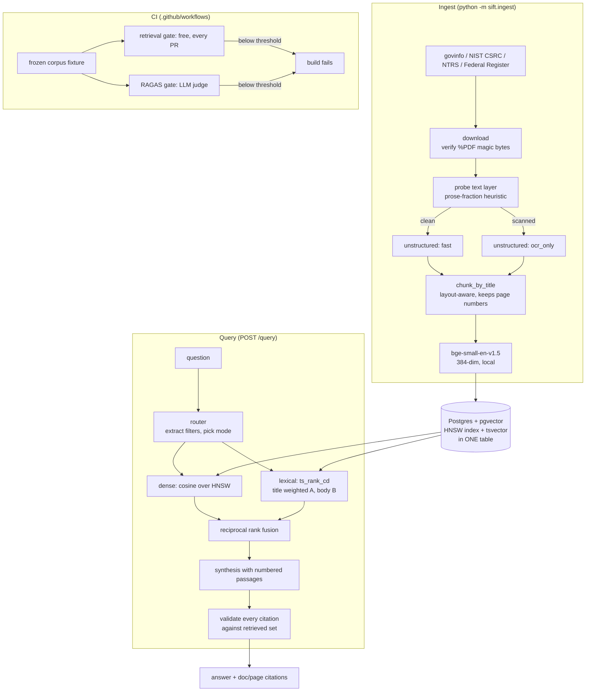

# Sift — Document Intelligence Pipeline

A retrieval system over messy public-sector PDFs — GAO reports, NIST
publications, NASA technical reports, the Federal Register — that answers
questions with page-level citations, and **fails its own CI build when answer
quality regresses.**

The last part is the point. Building a RAG demo is easy. Knowing that today's
version is not quietly worse than last week's is the hard part, and it is the
part that decides whether a system is deployable.

```bash
git clone <this-repo> && cd sift
docker compose up -d db                       # Postgres + pgvector
pip install -r requirements.txt
python -m sift.ingest --limit 500             # download, parse, chunk, embed
uvicorn sift.api:app --reload                 # http://localhost:8000/docs
```

---

## The problem

Government documents are hostile to naive RAG in specific, measurable ways:

- They are **multi-column**, so text extracted in the wrong order reads as word
  salad while raising no error.
- They are **table-heavy**, and a character-based splitter cuts tables in half.
- Many are **scans** — and the worst ones carry a text layer from decades-old
  OCR, so they *look* machine-readable and silently are not.
- The answers people need are **specific**: a number, a date, a statutory
  citation. "Roughly right" is wrong.

A pipeline that assumes clean text will produce fluent, confident, unsourced
answers over garbage. In a government setting that is worse than no system,
because the output is indistinguishable from a correct one.

---

## Results

Measured on the frozen evaluation corpus (`eval/fixtures/corpus.jsonl.gz`) with
36 hand-checked questions.

<!-- RESULTS:START -->
| Metric | Score |
|---|---|
| Recall@6 | _pending full-corpus run_ |
| MRR | _pending_ |
| Documents parsed | _pending_ |
| Median retrieval latency | _pending_ |
<!-- RESULTS:END -->

Retrieval metrics are deterministic and need no API key — they run on every pull
request. RAGAS metrics need an LLM judge and run separately. See
[Evaluation](#evaluation).

---

## Architecture



**Why one Postgres table holds both the vector and the full-text index.** There
is no second service to keep in sync, a chunk's embedding and its lexical index
cannot drift apart, and metadata filters compose with both retrievers — "NIST
documents from 2024" is a `WHERE` clause, not a separate filtered-search API.

---

## What broke and how I handled it

The full account is in **[docs/FAILURE_MODES.md](docs/FAILURE_MODES.md)**. The
four worth reading:

### `hi_res` produced the cleanest-looking and least readable text

Unstructured's `hi_res` strategy runs layout detection before OCR. On a 1967
NASA microfiche scan it carves the page into regions and emits them in the wrong
reading order — correct words, scrambled sentences. Every layout-based quality
metric rates it *excellent*, because the lines are well formed.

I measured it instead of guessing (`scripts/compare_strategies.py`), scoring
readability by common-English-bigram density, which survives
correct-words-wrong-order:

| strategy | seconds | garbled score | bigrams/1k |
|---|---|---|---|
| fast | 11.7 | 0.81 | 48.5 |
| hi_res | 40.1 | 0.05 | **23.9** ← worst |
| ocr_only | 36.3 | 0.04 | **50.4** ← best |

Scanned documents now route to `ocr_only`: faster *and* markedly more faithful.
The tradeoff — no table-structure reconstruction — is right for this corpus of
technical prose and would be wrong for scanned financial tables.

### Lexical search returned zero rows and nothing looked broken

`websearch_to_tsquery` joins terms with **AND**, so a natural-language question
demanded that one 1800-character chunk contain every word including "what",
"did" and "find". It matched nothing. Hybrid retrieval still returned
results — it had silently degraded to vector-only.

Fixed by stripping question scaffolding and OR-ing the content terms, letting
`ts_rank_cd` supply precision. Found by evaluation, not by any test or
exception, which is the argument for the CI gate in one sentence.

### Rank fusion depended on database row order

MRR moved between 0.953 and 0.932 on an identical corpus, purely from reloading
the database. RRF score ties are common, Python's sort is stable, and
`TRUNCATE`+reload renumbered the rows. Tie-breaking on `chunk_id` made it
deterministic — and dropped the honest MRR to 0.9167, lower than the number I
would otherwise have published and the first one that means anything.

### The quality gate would have skipped green instead of failing red

`ragas==0.4.3` imports a `langchain-community` module that the 0.4 line deleted,
so `import ragas` raised `ModuleNotFoundError`. Only the provider packages were
pinned, so pip resolved `langchain-community` to 0.4.2 and the eval could not
start.

The bug is not that it broke — it is *how* it would have failed. The RAGAS job
is guarded by "is an API key present?", so a gate that cannot import reports
**skipped**, and skipped renders green. A quality gate that silently does not
run is worse than no gate, because it manufactures confidence. Pinning the whole
langchain family to the 0.3 line fixed it, and CI now runs an explicit
`python -c "import ragas"` so this can only ever fail loudly.

---

## Retrieval

Three things happen before a passage reaches the model.

**1. Routing.** A rules layer reads the query and picks a strategy. It is not an
LLM agent and does not plan — calling it a router is the honest description.

| query | decision |
|---|---|
| "what did NIST publish in 2024 about zero trust" | `filtered` — `source=nist, year=2024` |
| "GAO/NSIAD-95-82" | `keyword` — dense retrieval is bad at identifiers |
| "how do agencies decide whether a control is effective" | `hybrid` — no anchors |

Filters are a `WHERE` clause, so a stated constraint is *guaranteed*, not hoped
for. Every decision is returned in the API response so it can be audited. When a
filter is too strict and returns nothing, the system retries unfiltered and says
that it did.

**2. Hybrid retrieval + reciprocal rank fusion.** Dense (cosine over HNSW) and
lexical (`ts_rank_cd`) run as two SQL queries, fused by rank rather than score:

```
score(d) = Σ 1 / (k + rank_i(d))        k = 60
```

Ranks are used because cosine similarity (~0.4–0.8) and `ts_rank_cd`
(unbounded, corpus-dependent) are not on comparable scales, and any weighted sum
needs constants that go wrong the moment the corpus changes.

**3. Citation validation.** Passages are numbered, the model cites by number,
and every citation is checked against the passages actually retrieved. A
citation outside that range is stripped and recorded — a model that cites `[9]`
of 6 passages does not get to keep it.

---

## Evaluation

Two tiers, split by what they cost to run.

### Tier 1 — deterministic, free, every pull request

```bash
python -m eval.retrieval_eval
```

No LLM, no API key, ~10 seconds. Measures `recall@k`, `MRR`, citation validity,
abstention rate, false-abstention rate, and retrieval latency.

The **false-abstention rate** exists because without it a system that answers
"I don't know" to everything scores a perfect abstention rate.

### Tier 2 — RAGAS, LLM judge

```bash
python -m eval.ragas_eval
```

`faithfulness`, `answer_relevancy`, `context_precision`, `context_recall`.
Costs money and needs `ANTHROPIC_API_KEY` or `OPENAI_API_KEY`.

### Why the split matters

If the only gate needed a paid key, pull requests from forks would silently skip
it — and "CI enforces answer quality" would be false in exactly the case where
you least control the code. Tier 1 always runs.

### The corpus is frozen

CI loads a committed fixture (`eval/fixtures/corpus.jsonl.gz`, 287 KB) rather
than re-downloading 500 government PDFs on every push. Embeddings are recomputed
at load time from a pinned model rather than stored, keeping the fixture ~20×
smaller and still deterministic.

This means a metric change is caused by **the code in the pull request**, not by
what the Federal Register published overnight.

### Thresholds

In [`config/thresholds.yaml`](config/thresholds.yaml). Citation validity is
`1.0` with no slack — a fabricated source is the one failure this project exists
to prevent.

**To watch the gate work:** open a PR that weakens the system prompt's citation
rule, or drop `final_top_k` to 1. CI goes red.

---

## API

```bash
curl -X POST localhost:8000/query -H 'content-type: application/json' -d '{
  "query": "What law requires the EPA to establish drinking water standards?",
  "include_passages": true
}'
```

```jsonc
{
  "answer": "The Safe Drinking Water Act, enacted in 1974, requires the EPA to
             establish drinking water standards for the nation's nearly 56,000
             community water systems [1].",
  "citations": [
    { "marker": 1, "doc_id": "gaoreports-rced-97-123", "page": 4,
      "title": "Drinking Water: Information on the Quality of Water Found..." }
  ],
  "abstained": false,
  "routing": { "mode": "hybrid", "filters": {}, "passages_retrieved": 6 },
  "invalid_citations": []
}
```

| endpoint | purpose |
|---|---|
| `POST /query` | answer with citations |
| `GET /search` | retrieval only — see exactly what the model was given |
| `GET /documents` | corpus inventory + ingest report, including failures |
| `GET /health` | database, chunk counts, LLM configuration |

`GET /search` exists because most RAG debugging is answering "what did the model
actually see?", and that should not require a database client.

---

## Corpus

| source | route | note |
|---|---|---|
| GAO | govinfo.gov API | gao.gov is behind Akamai; govinfo is the GPO's official mirror and reaches back to 1995 |
| NIST | CSRC search → nvlpubs | no publications API; blocks HEAD but allows GET |
| NASA | NTRS API | the main supply of genuine scans — 1960s microfiche |
| Federal Register | documents.json API | inconsistent typesetting from many agencies |

Documents that fail are written to `data/failed_documents.log` with the reason,
grouped by failure kind, and kept in the `documents` table with status `failed`.
"487 of 500" is only meaningful if you can say which 13.

---

## Layout

```
sift/
  config.py        all tuning in one place
  db.py            psycopg3, no ORM — the SQL is the interesting part
  sources.py       four site-specific adapters, quirks documented inline
  embed.py         local sentence-transformers
  llm.py           provider-pluggable (Anthropic | OpenAI)
  answer.py        synthesis + citation validation
  api.py           FastAPI
  ingest/
    download.py    magic-byte verification, honest failure records
    partition.py   text-layer probe, strategy choice, crash isolation
    chunk.py       chunk_by_title + page-number recovery
    pipeline.py    orchestration
  retrieval/
    router.py      query → filters + mode
    search.py      dense, lexical, RRF
eval/
  eval_set.yaml    36 questions, each grounded in a real passage
  retrieval_eval.py
  ragas_eval.py
  fixtures/        the frozen corpus
scripts/
  compare_strategies.py   the measurement behind the ocr_only decision
  fixture.py              export / load the frozen corpus
docs/FAILURE_MODES.md
```

---

## Design decisions

**Local embeddings, not an API.** `bge-small-en-v1.5` runs free and offline, so
the CI gate is real rather than stubbed. A quality gate that needs a paid key
per pull request gets disabled the first time it is inconvenient.

**Postgres full-text, not `rank_bm25`.** BM25 is the better ranking function.
But `rank_bm25` needs the whole corpus resident in the API process, rebuilt at
every start, and goes stale the moment a document is ingested. `ts_rank_cd` is
maintained by the database on a generated column. Worth stating plainly rather
than claiming a BM25 that is not running.

**Each parse in a child process.** `hi_res` calls into native code
(onnxruntime, poppler, tesseract), which can segfault or hang — neither
catchable with `try/except` in-process. One bad PDF must not end a 500-document
run.

**Parse timeout scales with pages.** `fast` runs ~0.2s/page and `ocr_only`
~36s/page. A single flat timeout is either far too generous for a 500-page text
PDF or kills a 12-page scan halfway through.

**Failures are rows, not log lines.** Ingest telemetry lives in the `documents`
table, so "what happened to document X" is a query.

---

## Honest limitations

- **Tables are not reconstructed on scanned documents.** `ocr_only` was the
  right trade for this corpus and would be wrong for scanned financial tables.
- **The eval set needs a human pass.** It was drafted from real retrieved
  passages and each answer is checkable against its cited page — but an eval set
  nobody has read is a liability, because it gates CI on unverified assertions.
- **The RAGAS judge shares a model with the generator.** A model grading its own
  output is measurably more generous. Treat those four numbers as regression
  detectors, not absolute quality.
- **The router is rules, not an agent.** Deliberately. It is testable and
  debuggable, and it is described as what it is.
- **One known retrieval miss** (`q017`), left failing on purpose — it needs
  query rewriting, which is not built.

## What I'd do next

1. **Query rewriting / HyDE** for the `q017` class of failure, where the literal
   phrasing points at the wrong corpus.
2. **A cross-encoder reranker** over the fused top-20. The cheapest remaining
   precision win.
3. **Table-aware routing** — send scanned documents that *contain* tables to
   `hi_res` and prose-only scans to `ocr_only`, instead of one rule for all.
4. **Judge/generator separation** in RAGAS, using a different model family for
   the judge.
5. **Track metrics over time** in `benchmarks/`, so the gate catches slow drift
   and not just single-PR regressions.
